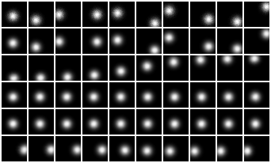
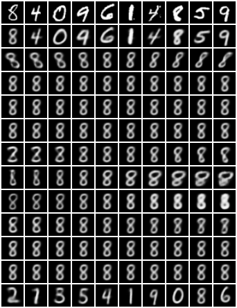

# Investigating the Robustness of Disentangled Generative Models to Adversarial Examples

## Latent traversals

In all of the following images, the first row depicts randomly chosen datapoints from the dataset, while the second row depicts their reconstructions. The remaining rows (one row per latent) show the latent traversals of the image in the upper-left-corner.

#### Gaussian blobs

#### MNIST

